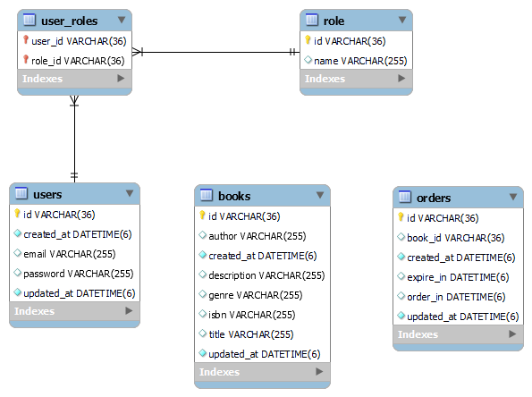
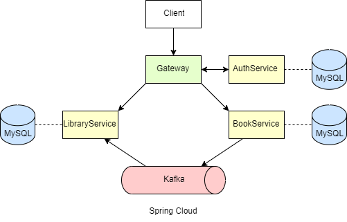

# Library Web API

This project involves the development of a CRUD Web API for simulating a library system using the Spring framework.

## Project Setup

To run this project, follow these steps:

1. Clone the repository.
2. Configure the database settings in `config-server`.
3. Build and run the project using Maven or your IDE.

## Main Web API Functionality

### Book Information

1. Retrieve a list of all books.
2. Get a specific book by its ID.
3. Find a book by its ISBN.
4. Add a new book.
5. Update information about an existing book.
6. Delete a book.

## Additional Web API Functionality

1. Develop an additional service (LibraryService) for tracking available books.
2. Upon adding a new book in the primary service, send a request (synchronous or asynchronous) containing the book ID.
3. The new service stores information about:
    - The book (ID).
    - Time when the book was borrowed.
    - Time when the book is due to be returned.

## Implemented Functionality

1. Retrieve a list of available books.
2. Modify book information.

## Technologies Used

1. **Spring Boot 3**
2. **Java 17**
3. **ORM**: **Spring Data JPA**
4. **RDBMS**: **MySQL** (database per microservice)
5. **Spring Cloud Config**
6. **API Gateway**
7. **Eureka Discovery**
8. **Apache Kafka** for user notifications on order creation
9. **OpenAPI Swagger**
10. **Maven Multi-Module Project**
11. **Spring Security** for authentication
12. **MapStruct**
13. **Docker** for containerization and deployment

## Database Schema



## Project Architecture



### How to start application?

1) Clone project
```
git clone https://github.com/artemelyashevich/library-api.git
```
2) Start kafka (from kafka directory in your pc)
```shell
.\bin\windows\kafka-server-start.bat .\config\server.propertie
.\bin\windows\zookeeper-server-start.bat .\config\zookeeper.properties
```
3) Start Config Server
```shell
cd .\config-server\
mvn spring-boot:run
```
4) Start Discovery Service
```shell
cd .\discovery\
mvn spring-boot:run
```
5) Start Gateway Service
```shell
cd .\gateway\
mvn spring-boot:run
```
6) Start Book Service
```shell
cd .\book-service\
mvn spring-boot:run
```
7) Start Library Service
```shell
cd .\library-service\
mvn spring-boot:run
```
8) Start Auth Service
```shell
cd .\authentication-service\
mvn spring-boot:run
```
### Http Requests Examples

```http
   ### Expext code 201 & auth token 
   POST http://localhost:8222/api/v1/auth/register
   Content-Type: application/json
   {
      "email": "example@example.com",
      "password": "password12345"
   }
   
   ### Expext code 201 & auth token 
   POST http://localhost:8222/api/v1/auth/login
   Content-Type: application/json
   {
      "email": "example@example.com",
      "password": "password12345"
   }
   
   ### Expext code 200 & auth token 
   POST http://localhost:8222/api/v1/auth/{token}
   
   ### Expect code 200 & list of books
   GET http://localhost:8222/api/v1/books

   ### Expect code 200 & book (if exists)
   GET http://localhost:8222/api/v1/books/{bookId}
   
   ### Expect code 201 & book
   POST http://localhost:8222/api/v1/books
   {
      "title": "The Great Gatsby",
      "description": "A story of the Jazz Age",
      "genre": "Classic",
      "author": "F. Scott Fitzgerald",
      "isbn": "111-1111111111"
   }
   
   ### Expect code 200 & book
   PATCH http://localhost:8222/api/v1/books/{bookId}
   {
      "title": "The Great Gatsby",
      "description": "A story of the Jazz Age",
      "genre": "Classic",
      "author": "F. Scott Fitzgerald",
      "isbn": "111-1111111111"
   }
   
   ### Expect code 204 if book exists
   DELETE http://localhost:8222/api/v1/books/{bookId}
   
   ### Expect code 202
   POST http://localhost:8222/api/v1/books/order
   
   ### Expect code 200 & list of orders
   GET http://localhost:8222/api/v1/library/active
   
   ### Expect code 200 & list of not expired orders
   GET http://localhost:8222/api/v1/library/active

   ### Expect code 200 & order (if exists)
   GET http://localhost:8222/api/v1/library/{orderId}
   
   ### Expect code 201 & book
   POST http://localhost:8222/api/v1/library
   {
        "bookId": "bookId-example",
        "expireIn": "",
        "orderIn": "",
   }
   
   ### Expect code 200 & order
   PATCH http://localhost:8222/api/v1/library/{orderId}
   {
        "bookId": "bookId-example",
        "expireIn": "",
        "orderIn": "",
   }
   
   ### Expect code 204 if order exists
   DELETE http://localhost:8222/api/v1/library/{orderId}
```